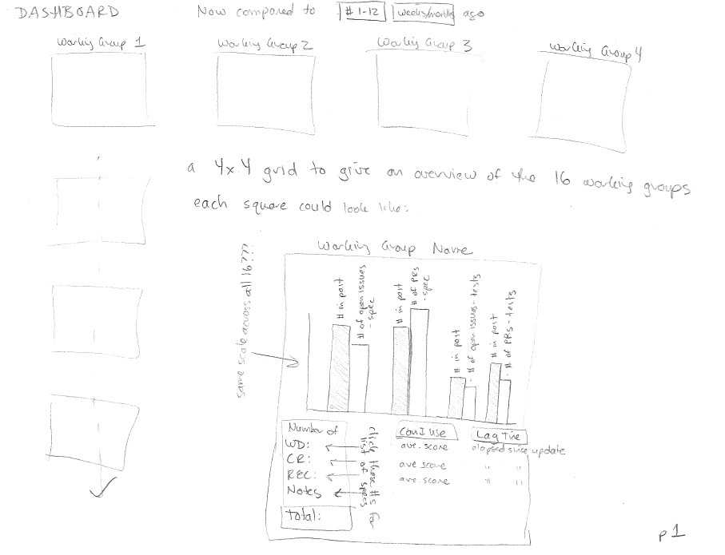
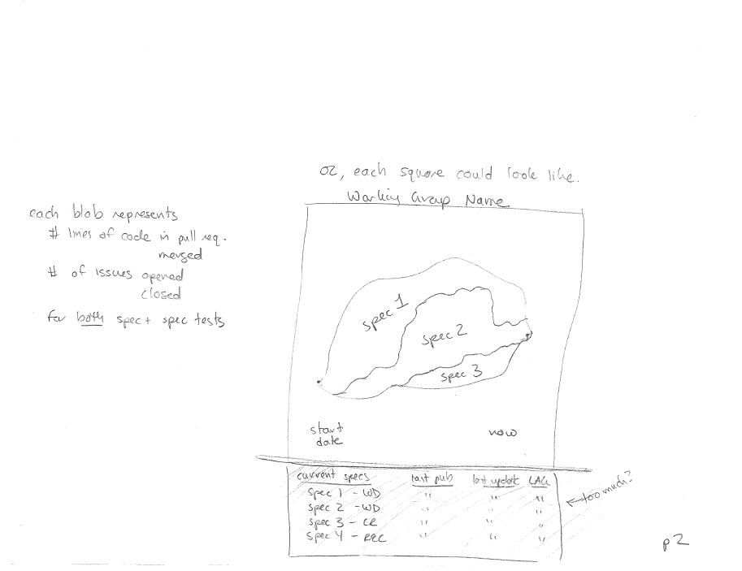
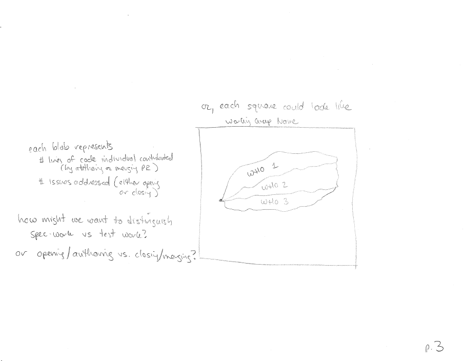
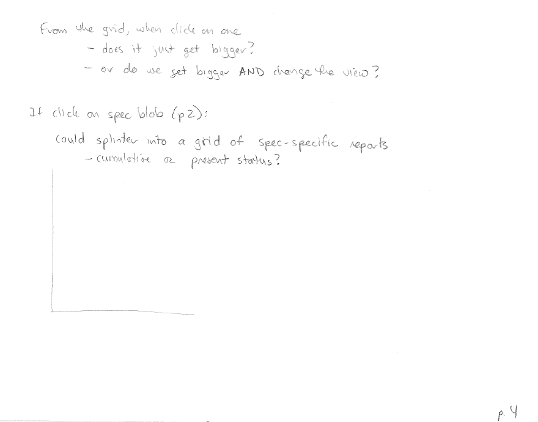
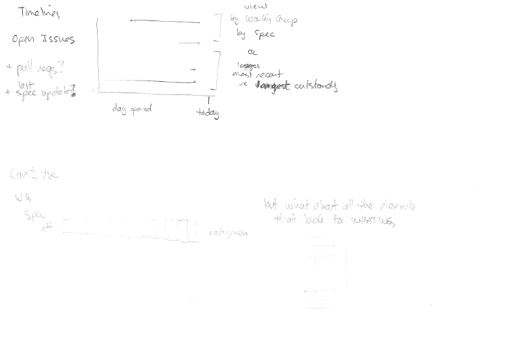
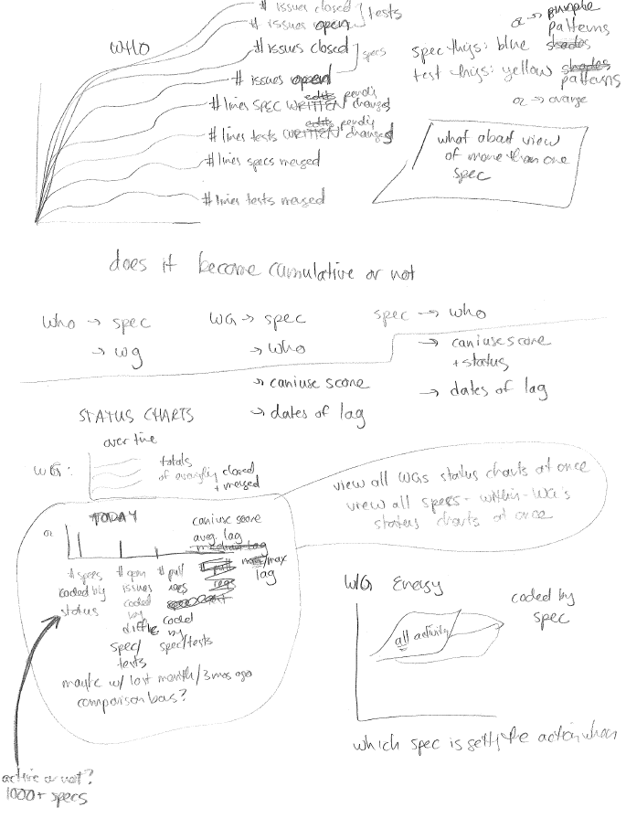
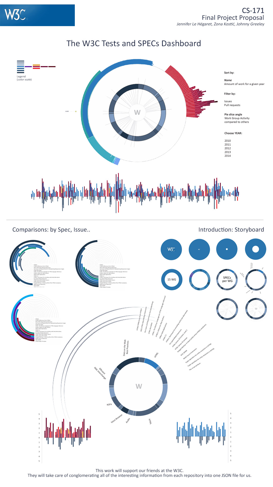

# Section 4 - Our Design Process

* *return to [Section 3, What W3C Has So Far](existing.md)*
* *proceed to [Section 5, Our Proposed Feature Set](proposal.md)*

* The History:  The Seed, and Zona's Take
* [The Continued Overview](design_details.md)
* Evolution
  * [of the overall page](design_index.md)
  * [of the sunburst](design_sunburst.md)
  * [of the timeline](design_timeline.md)
  * [of the who graph](design_who.md)

## The Seed

As Jennifer spoke with W3 about what they wanted to see that was different than what they already had, the main question she heard W3C ask was "how are the working groups spending their time?"

As a result, she came up with these rough and unsatisfactory sketches:

<table>
  <thead>
    <tr><th>Sketch</th><th>Notes</th></tr>
  </thead>
  <tbody>
  <tr>
    <td></td>
    <td>Here, Jennifer imagines an array of Working-Group specific bar charts, each one showing the number of closed items and open items in groups depending on if the items are pull requests or issues, and spec-related or test-suite related.  This is obviously completely unscalable, even if it might give a sense of which Working Groups are juggling the most work.  It also fails to give any sense of what is done <i>over time</i>i>.
    </td>
  </tr>
  <tr>
    <td></td>
    <td>Then, Jennifer thought of something similar to the stacked area baby names chart - Across W3C, how much work are the various working groups doing over time?  Or, for a given working group, which specs is it working on over time?</td>
  </tr>
  <tr>
    <td></td>
    <td>It was also perhaps interesting to see WHO was doing how much over time.  However, this view does not allow us also to understand ON WHAT is that person working.</td>
  </tr>
  <tr>
    <td></td>
    <td>More thoughts are preserved here... How to navigate from view to view?  How to see more data as questions arised based on some given context?</td>
  </tr>
  <tr>
    <td></td>
    <td>And then there was the timeline question.  Would we want to see the duration of issues and pull requests being open?  This would tell us how many "to do" items existed at any point in time, as well as how long it took to do them, but it would probably be overwhelming in terms of the number of items that would be displayed in such a view.</td>
  </tr>
  <tr>
    <td></td>
    <td>Here is Jennifer's attempt to coalesce the prior ideas into one system.  However, this system still involved a lot of switching from view to view, limitations in terms of how much data could be seen and compared at once, and still just seemed overly amateur.</td>
  </tr>
  </tbody>
</table>

Luckily for W3C and this project, Zona has a designer's flair.  After discussing the background of W3C and the objective for this project with Jennifer, she took the project's design to the stratosphere.  Read on...

## Zona's take

With our graphic, we would like to avoid the often overwhelming "show all you have" type of design. The challenge with data visualizations is that large datasets are visualized at once. The first problem with that is that a large number of elements confuses users. Second, there is not enough additional space for explanations nor legends and thus, as a consequence, the graphic is not readable.

With this W3C data, we need to understand it layer by layer.
* First, W3C is the organization responsible for developing specifications about web technologies.
* It is divided into several Working Groups who cover a certain specialization within web technologies.
* Each Working Group divides its work into developing a multiple number of specs.
* As each spec reaches recommendation status, another piece of the web solidifies enough to be built upon.
* In order to reach recommendation status, a spec needs to be written, tested, and proven to be reasonably implemented across some number of browsers.  The work done to move a spec forward (for our purposes) consists of various GitHub updates of different types, having different statuses and representing different amounts of work.

As Zona processed this hierarchy, she imagined this storytelling process:

    

The idea of introducing our interface using step-by-step animation is to simplify the main view. Going through the different steps, we can tell a story about W3C and at the same time introduce users to our different visual variables and what they represent.

These are the steps, per row of her diagram:
1. Display W3C as one circle
2. Introduce working groups and specs per working group
3. From specs to overall W3C contribution
4. Represent overall W3C contribution.

For the main page, which needs to show thousands of datapoints across multiple categories, Zona envisioned the dashboard along these lines:

    

Of these ideas, she chose the first as our first visual target.

Continue on to the [next section](design_details.md) to learn more...

