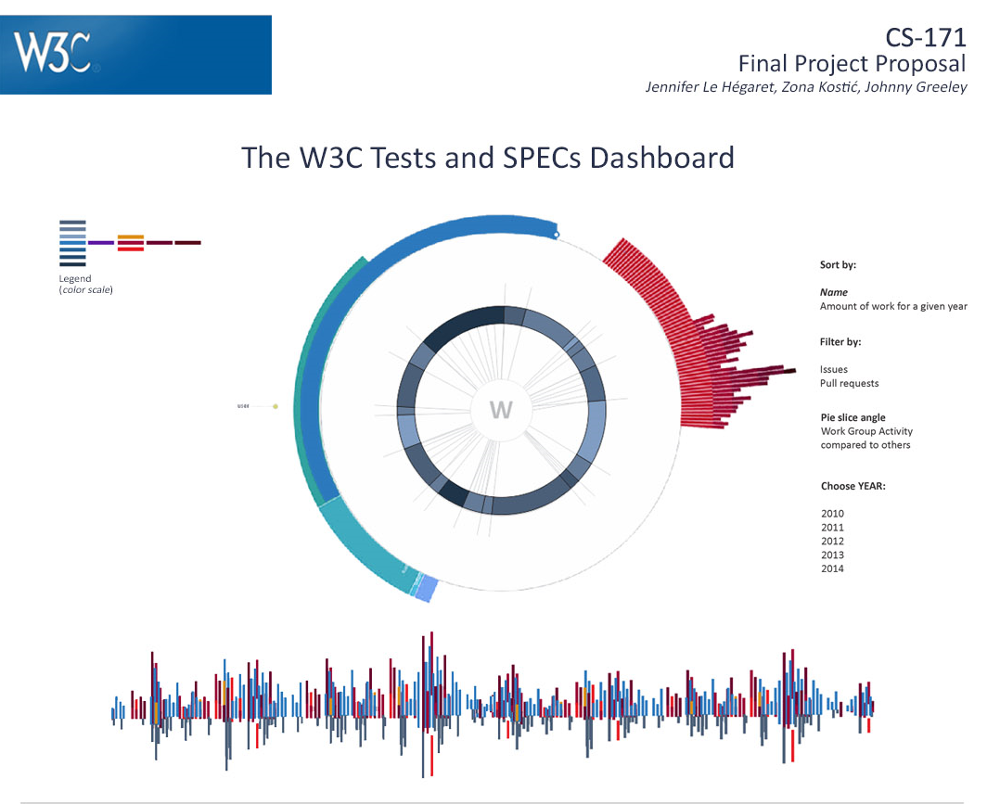
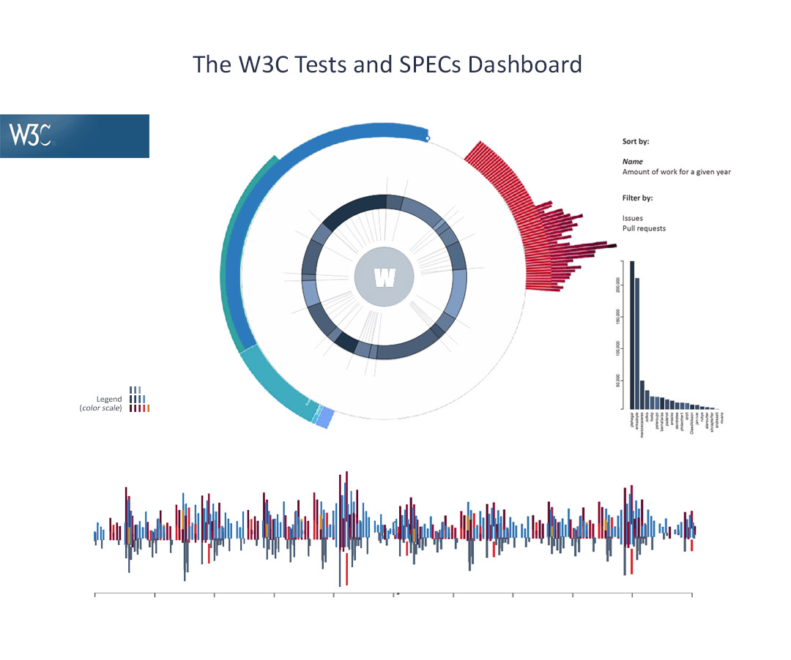
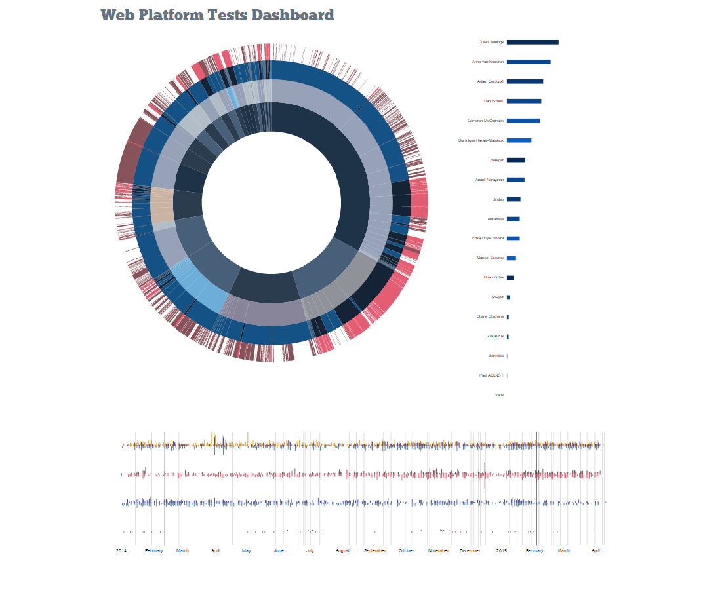
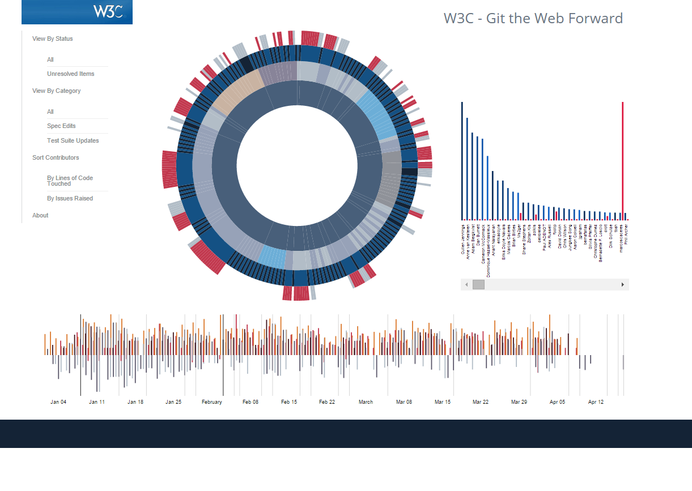
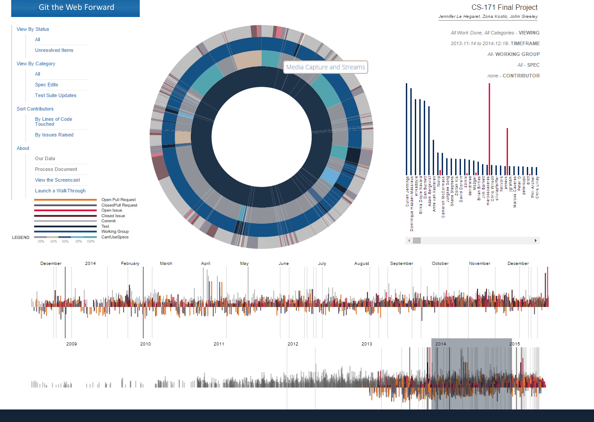

# Section 4 cont. - Our Design Process - Continued Overview

* *return to [The Design Process - Beginnings](design.md)*
* *proceed to [The Design Process - Dashboard](design_index.md)*

## Understanding the Visualization, 3/31/15

In its first iteration, the dashboard consisted of two parts:  a sunburst tree diagram and a timeline.

    

### Sunburst

This simple sunburst shows only the working groups, not individual specs.  We can evaluate the amount of work being done by viewing existing pull requests (blue left) and issues (red right). Here, dark red signifies hard issues. The idea is to see the amount of work that has been done as compared to work still outstanding.

A second, full view (showing working groups, specs, issues, pull requests) would also be possible. At this point we can compare working groups, issues per working group, issues per spec… The idea to visualize all at once is to assess the maximum amount of visual elements we might have at a particular moment. Data will be filtered by spec or working group, so that the information provided via the sunburst will be most meaningful.

### Timeline

The timeline needs to represent all easy issues, hard issues, pull requests and the number of lines merged via those pull requests by using different colors. First,  we will present the total amount of issues, pull requests and lines merged. Second, when the user uses the sunburst to select a certain working group or spec, the timeline will update accordingly. Also, timeline brushing will affect the number of elements shown on the sunburst.

## Design Meeting, 4/4/15

At this meeting, the three of us delved into Zona's graphics to understand our implementation goals.

### Sunburst

In a way, we would implement the sunburst from the outside in.  The outermost fourth layer would be defined by all of the open and closed pull requests and issues for a particular spec. The third layer would provide areas that encompassed all of that various work per spec.  The second layer represented the working groups, and each area within that layer encompasses all specs worked on by one working group.  And the very center is W3C as a whole.

We imagined that closed issues, merged pull requests, open issues, and open pull requests would each have a width of "1", but that their heights would vary according to the difficulty level or number of lines of code affected.  Each type would also be keyed with a different color, and sorted together so that the user could tell at a glance what proportion of work had been done and what type was left to do.

We imagined that, as we zoomed in and out of the various layers (so that the entire sunburst could be used to display the work done for only one spec, for example), the timeline would also update.  And that, as we brushed the timeline, the work represented by the sunburst would be filtered to show only the work done within the chosen timeframe.

Lastly, we figured that we could incorporate the CanIUse score that we planned to calculate as a way to calculate the color of each spec's particular region on the sunburst graph.  Like that, as the user looks at the wheel of specs, the user can readily see which specs have been well-implemented and which are still ahead of their time.

### Timeline

At this point, we envisioned just one timeline axis which would be a grouped AND stacked bar chart per day.

Data points for each type of work would be stacked upon each other (all pull requests merged on a given day, all issues resolved on a given day) while each type's stacked bars would appear next to each other within a given day - so, for a timeline of 5 days, we envisioned displaying 20 bars - one for opened pull requests, a second for opened issues (and both of those would appear as "negatives", as they represent work "to do"), a third for merged pull requests, and a fourth for closed issues (both of those appearing as "positives", as they represent completed work).

Color coding would match the eventual color coding of the sunburst - open pull requests would be light blue, closed pull requests would be dark blue.  Open issues would be bright red, closed issues would be dark red.  However, we did wonder how to put a bit of yellow into the graph somehow as well.

As for scale, pull request bars would be scaled based on the total numbers of lines of code, while issues would be scaled from 1 to 3 - 1 being easy, 2 being not-easy, and 3 being unknown difficulty.

Lastly, because it is interesting to W3C to see how long has elapsed since a specification was last published, we also planned to add dark gray lines to the timeline to represent the last published date for all specs currently shown in the sunburst.

## Adding a third element - the Who data, 4/5/15

For the continued evolution of the [sunburst](design_sunburst.md) and of the [timeline](design_timeline.md), please see their specific histories.  However, shortly after the 4/4 Design Meeting, we decided also to take advantage of the people-oriented data we had by creating a "who" graph.

We realized that we could also provide a bar chart demonstrating how much code any particular person had contributed to any particular spec or working group's efforts.  We would plan to show the top contributors, and now our dashboard would look something like this:

    

See [here](design_who.md) for further information about the evolution of the who graph.

By organizing components like this, we successfully establish a visual balance. By placing the W3C logo in the upper left corner and more of the components on the right, we followed the visual diagonal (upper left - lower right corner) that is natural to all users.

## W3C Feedback, 4/23/15

We were fortunate to receive feedback directly from W3C as to our three-part Visualization as it stood so far:

    

We asked Robin Berjon:

*Given the data that we have, what are the questions you envision
asking of it most often?*

<blockquote>

I don't know if it's "most often", but I would certainly be interested in seeing trends, for both people and projects.

Basically, if a specification is seeing increased work over the past few weeks it probably means that something interesting is going on with it, I'll want to go see it. Conversely if the activity level on a spec dwindles it might mean that it's in trouble and requires intervention.

Similar reasoning applies to contributors. We regularly need fresh faces to e.g chair a group or participate in a workshop, the TAG, etc. It would be useful to be able to find out that someone has over the past three months become pretty active. Conversely, some people are listened to because of their past contributions, despite the fact that they haven't actually been contributing in a while. This could be a tool for honesty there.

Seeing the collaborations graph would be interesting too. Basically having a vertex per contributor and an edge whenever two contributors have both contributed to the same directory (I'm guessing as some form of force-directed graph). This should allow us to see communication breakdowns (e.g. how people in one area don't at all collaborate with people in another) to remedy. If, as I would expect, the resulting graph is more or less a Small-World system it should allow us to detect highly connected people who basically make the organisation effective. Again this is useful to find good participants for some functions, as well as to assess the damage (and therefore what needs be done) when someone leaves.

</blockquote>

*What's missing?*

<blockquote>
As you point out, the legends and stuff. Also when clicking on the
timeline view to popup the pale yellow thing, I can't seem to get it to close.
</blockquote>

*How would you want to use the "who" list?*

<blockquote>

At the very least hovering there should probably highlight the relevant parts of the circle thing? Also, the "who" list should sync with the circle view: if I'm only looking at a group or spec I should only see the relevant who?

Maybe also sorting people by different criteria: PRs, issues, comments, lines of code, etc. I'm not necessarily interested in a leaderboard, but more in getting a sense for who contributes how. Someone who files a lot of issues or writes a lot of tests should likely be acknowledged in the specification even if they haven't written one line of it, for instance.

</blockquote>

*How might you want to change the timeline view?*

<blockquote>
I can't really get it to work. I can select a rectangle there but it doesn't seem to affect anything.
</blockquote>

*How might you want to change the circle view?*

<blockquote>
I think that getting the commits information would be helpful (assuming it fits). The tooltips could use a little bit of padding and colour contrast.
</blockquote>

*Does the overall layout and look work for you?  How could it be better?*

<blockquote>
Yes, aside from the small bugs I mentioned it's really nice and usable.
</blockquote>

### Resulting Action Items / Hopes

* Continue our work to add interaction and filtering across views.
* Continue our work to improve the overall visual experience (including tooltip formatting as well as adding legends and other instructional guides).
* If we can add Commits information back in, we should, even though we have only one side of it.
* In the existing who graph, try to add viewing and sorting by issue as well as by number of lines of code affected.
* Once the visualization is in place, pay especial attention to how it helps view contributions over time.  Does the timeline / other graph interaction help identify trends easily enough?
* Consider adding a fourth, network graph if at all possible.
* For post-project efforts:  try to obtain data about comment-making from GitHub as well as the test suite commits.  Those TWO additions would hopefully comprise the full set of contributions to W3C spec development via GitHub.

## Check-In Meeting, 4/30/15

At this meeting, we reviewed where we were compared to where we wanted to end up.  By this time, based on the W3C feedback, we had added back in commits data and expanded the data visualized in the who graph, and, overall, we were in good shape and did not have any major design issues.

Some discussions were made about specific visualizations, which are detailed in their specific histories.  Also, some new elements did need to be added: a user selection tool for choosing some of our filter options, and an area in which we could display text summarizing the chosen filter options.  Luckily, both of these promised to fit in well with our current layout.  We also discussed adding a splash screen that would display as our data loads.

    

We find it rather remarkable, really, how closely this already matches the ambitious original vision.

## Final Iteration, 5/5/15

    

While this last iteration is a bit busier than the original vision, it packs in even more information while also providing more "focus and context" information to the user.  In addition to the doubled timeline, we also fit filter summary text, a more extensive and visible legend than first imagined, and more menu options than first imagined.

While additional time might help us gain additional sleekness by implementing multiple fisheye views and collapsing menus by default, it is an attractive and effective, elegant visualization of a huge amount of connected data which was, up until now, quite unmanageably dispersed.
