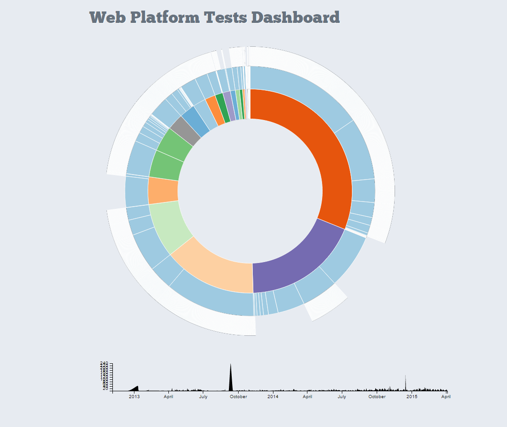
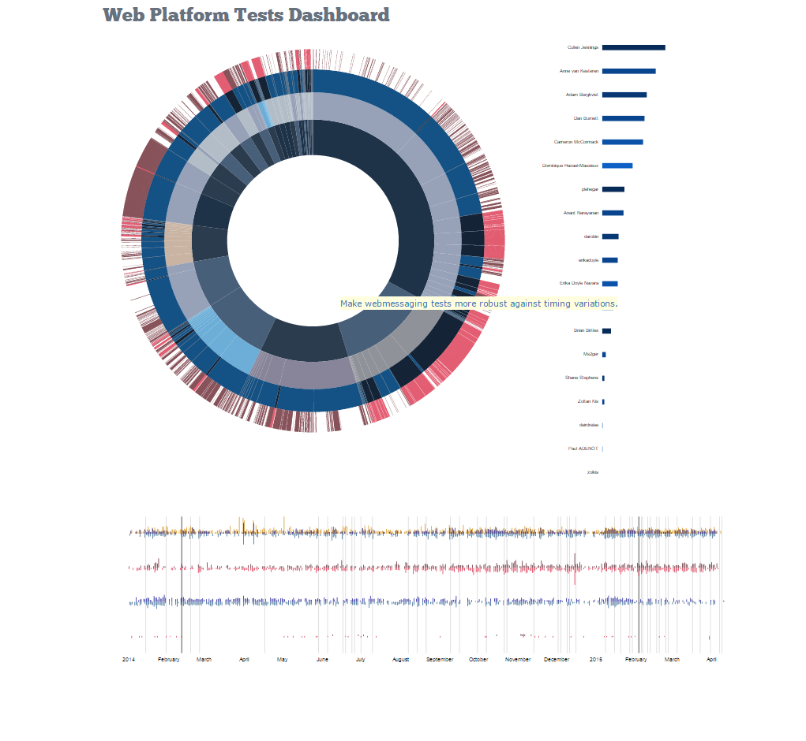
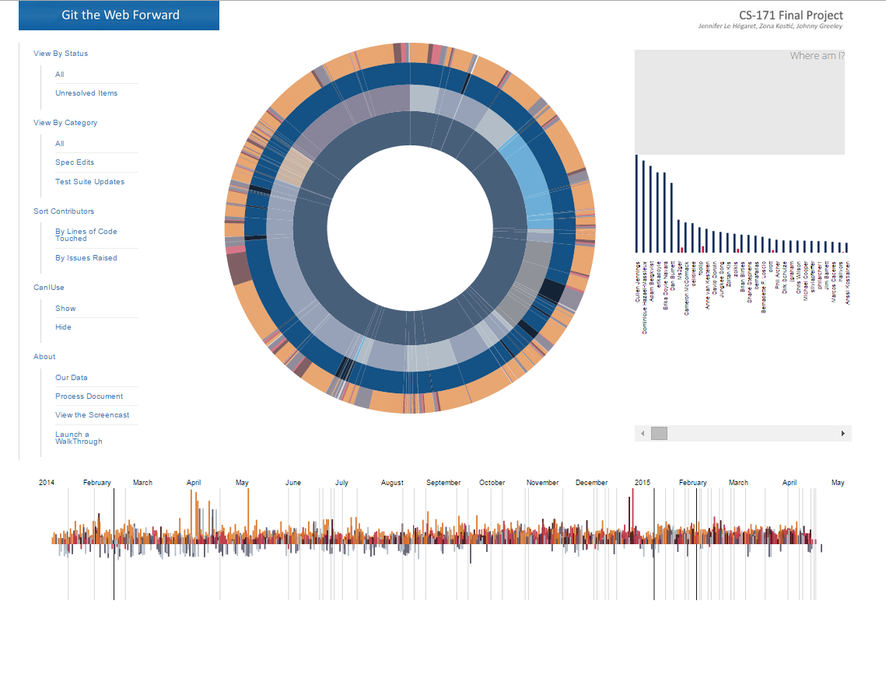

# Section 4 cont. - Our Design Process, the Dashboard

* *return to [The Design Process - Further Details](design_details.md)*
* *proceed to [The Design Process - Sunburst](design_sunburst.md)*

## The Dashboard Itself

One thing to note, which has been helpful during our design decisions, is that we can be sure that our users will in general be viewing our website on extremely large monitor screens, with the occasional laptop-only usage.  Our users are computer programmers by trade and will have all the productivity-enhancing hardware available.  We do not have to worry about supporting mobile.

As we began work, we at first stuck closely to look of the [website](www.testthewebforward/dashboard) that we may eventually replace.  John quite wonderfully got this visualization of the data in place pretty much the same day that he came on board!  (With brushing included.)

    

By the time that we met with our TF (or "marker"), we had dared to go a bit more "infovis" style, towards Zona's vision:

    

Once the fundamental graphs were in place, Zona was able to spend some time further improving the overall look while Jennifer re-consolidated the timeline in anticipation of taking advantage of the "focus and context" axis recommended by our TF:

    

As we continued work on each visualization within the pages, improving focus capabilities and adding descriptive text and legends, the dashboard finally looked like:

    

As we used our creation, we identified the need for more informational text.  Now, we have a legend just under our menu options, and we have a listing in the upper right to summarize all of the applied filters.

All elements on the page communicate with each other - filtering data in one graphic affects the data shown in the other graphics.

The color scheme is quite sophisticated.  This may be an area which deserves further development, to ensure that different working groups and different specs are more recognizable despite the pleasing aesthetics.  However, code contributions that have truly been merged into the repos are clearly distinguishable from code that has been proposed but has not yet been merged, and the issues vs. code distinctions are clear as well.  Overall, it provides an impressive degree of visual clarity despite the huge amount of information presented.
