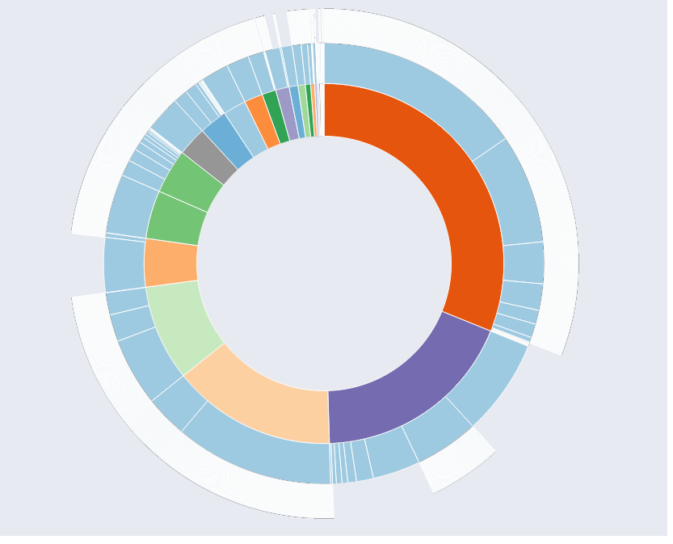
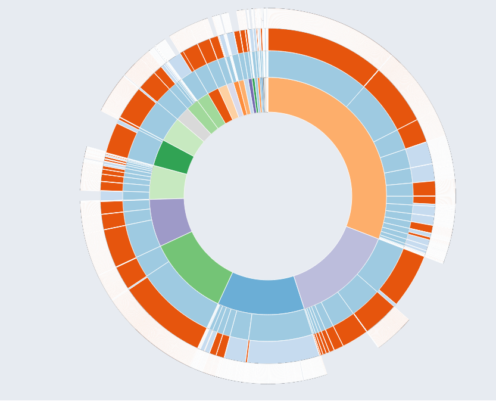
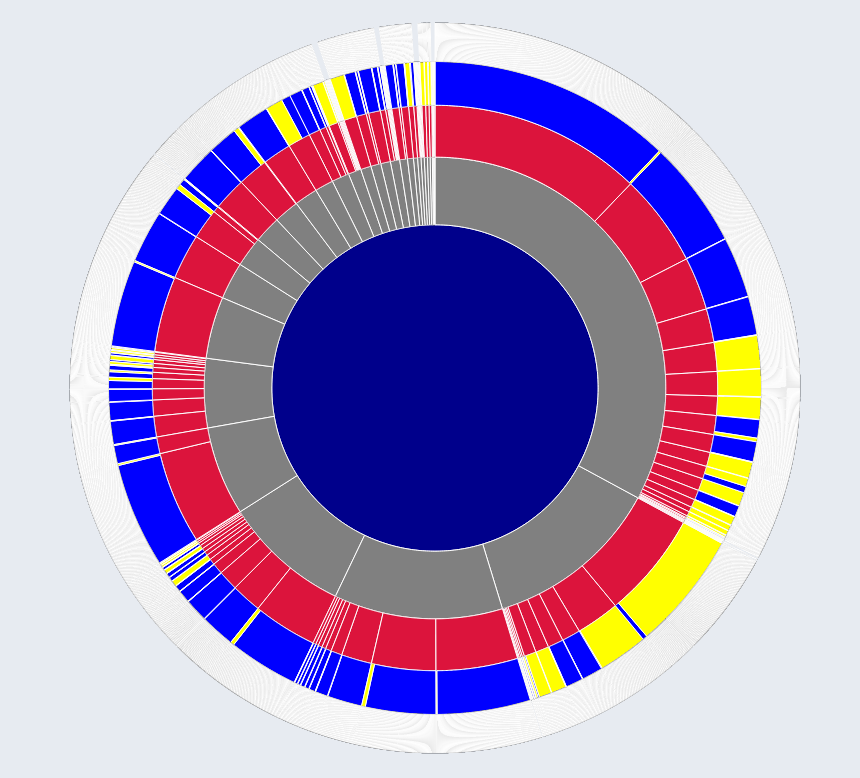
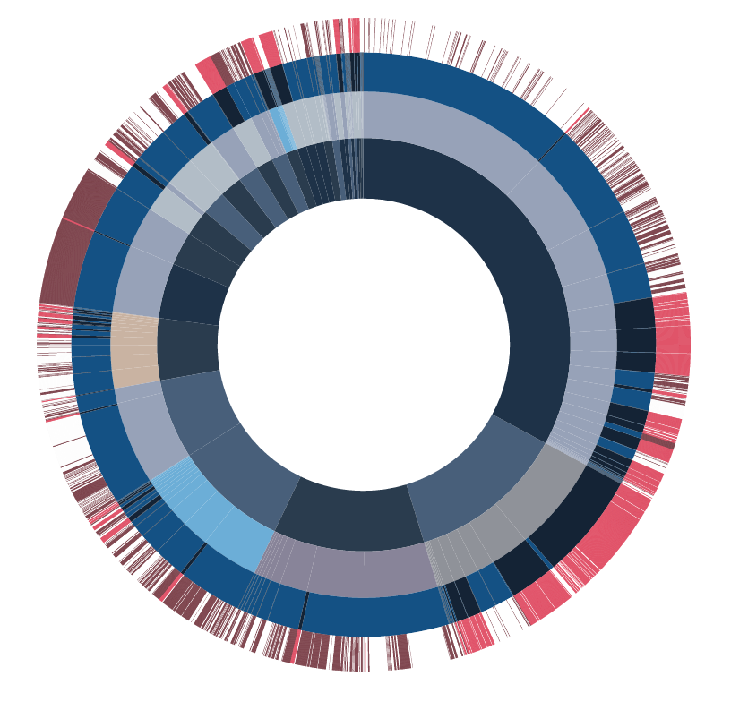

Section 4 cont. - Our Design Process, the Sunburst

* *return to [The Design Process - Dashboard](design_index.md)*
* *proceed to [The Design Process - Timeline](design_timeline.md)*

## The Sunburst

    

We refer to the large circle at the top left of our charts as the "sunburst".  It is a hierarchical tree structure.  Its root is W3C as a whole.  Its next layer is formed of the various working groups within W3C.  Then, there are a layer of all of the specs that each working group contributes to.  Lastly, there is the outer layer of the exact kinds of contributions to that spec which have occurred.

At first, the sunburst looked like this:

    

Then, we realized that we needed an additional layer between the specs and the precise contributions, so that contributions made to the spec text itself would be distinct from contributions made to the test suite for that spec:

    

Eventually, we used colors semantically rather than relying on D3's rather random sample of colors.  Now, the Working Groups ring was one color, Specs another (which would hopefully be affected by each Spec's CanIUse score), the Test Suite vs. Spec Text categorization ring consisted of a binary choice in color, and the last layer had the most color-coded information: pull requests vs. issues, each of which having open vs. closed statuses.

However, due to the number of individual contributions forming the outer ring, the border on each element still just makes the entire ring look white when viewing all the data:

    

Also, these colors, being quite flat, appeared quite amateur, and so we chose a more sophisticated palate and added gradations to be more pleasing to the eye.  This version was ready for outside review:

    

