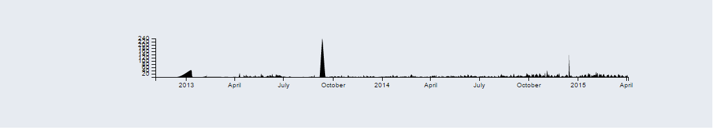
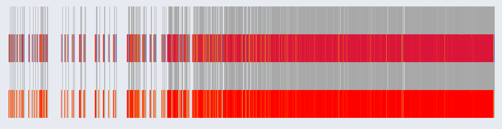
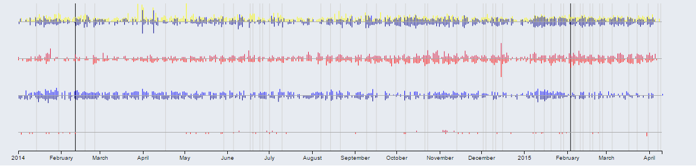

Section 4 cont. - Our Design Process, the Timeline

* *return to [The Design Process - Sunburst](design_sunburst.md)*
* *proceed to [The Design Process - Who](design_who.md)*

## The TimeLine

    

The timeline shows all of the work represented by the sunburst graph, but across time.

As issues and pull requests are opened, they show up as "negative" amounts, and the height of their bar depends on the difficulty (issues) or number of lines of code affected (pull requests).

As issues and pull requests are closed, they show up as "positive" amounts.

We planned that issues would be red, while pull requests would be blue.

### Development

First, we needed something as a fast placeholder which could also interact with the sunburst.  Here, we see one simple path element, all in black, showing the overall amount of work done over time as measured in issues.

    

However, we wanted our color-coding by contribution type.  Also, given that every day presents a SUM of the work done by type on that day, it was hard to present the number of issues on the same scale as lines of code.  Our first attempt to create two x axes, one for each scale, showed us quite quickly that there was too much data to fit in 5 bars per day for the entire time frame.  As you can see, there is so much work done in recent times that the bars overlap, making purely saturated color.

    

Due to the crowdedness of the data, we broke up the types of work into yet more axes, so that that every day could be just 1-2 pixels wide rather than 5.  The top two lines represent code and issues for the specs themselves, while the bottom two lines represent code and issues for the test suite.

Even so, the complete history of data seemed too much for the graph.  We turned to pre-emptive filtering to show data for the most recent year and a half.  This seemed reasonable, given that W3C seems most interested in trends over the last few months:

    

Gray lines represent "last published" dates of non-Recommendation-status specs, while black lines represent "last published" dates of Recommendation-status specs.  W3C hopes that all of its non-Recommendation specs are updated everything three months, so we can already see that a lot is falling through the cracks - many specs are older than three months.

We then added tooltips to list all of the pieces that went into forming each bar help identify what happened when, and which specs were published when.

