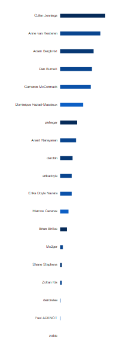
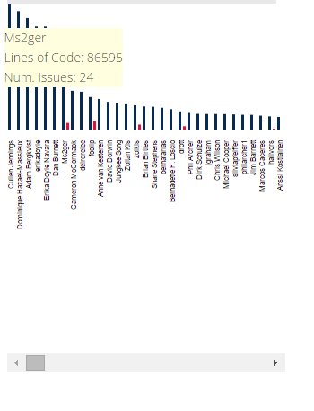
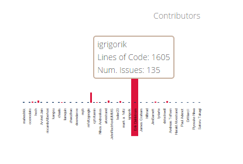

Section 4 cont. - Our Design Process, the Who Graph

* *return to [The Design Process - Timeline](design_timeline.md)*
* *proceed to [Section 5, Our Proposed Feature Set](proposal.md)*

## The Who Graph

    

Even though the original vision had imagined a horizontal bar chart, our first iteration was vertical:

    

However, we did rotate it to match the original vision and fit into the space better.  Also, rather than limiting the display to only the top "n" leaders, we decided to display the whole list of relevant contributors, along with a way to scroll through the list.

This graph reacts to events coming from the other visualizations and from the user interface.  Through manipulation, the user is able to view all contributors:
- to a certain working group
- to a certain spec
- within a certain timeframe
- sorted in descending order by amount of code touched
- sorted in descending order by the number of issues opened or closed
- counting the amount of work done across all work done or only for currently unresolved items
- counting the amount of work done across all categories, only for spec edits, or only on the test suite.

In turn, clicking on a contributor as displayed in this visualization filters both the sunburst and the timeline graphs, so that we see only the work done by that one individual over time and by Working Group and Specification.

Tooltips currently allow the user to learn the absolute number of the lines of code or the difficulty sum of the number of issues raised or closed by that contributor.

    

We hoped to use a fisheye view rather than slider view.  While it looked sleeker, it proved remarkably hard to use and tweak to our liking.  The invisible slider would activate as we attempted to select a bar, and moved way too fast.  The bars did not increase in size to make selecting them more easy - and just one bar increased in size once we managed to hover over it without triggering the slider.  The names were very hard to read.  And we would get "stuck" in the lower values of the range and not be able to return to the head of the list.

    

So, we went back to our slider approach.

    

